# Investigating Optional ("MAY HAVE") Cardinality in IDS Requirements — Experimental Documentation

A structured record of validation experiments performed in usBIM.IDSeditor and usBIM.IDS, conducted to answer a student question raised during the IDS module Q&A.

| | |
|---|---|
| **Author** | Arghavan Akbarieh |
| **IDS document tested** | 2026_ProcessModellingSpecification.ids |
| **IFC model tested** | ILS-woco 3.0_variant A.ifc |
| **Tools used** | usBIM.IDSeditor 2.4.8.0 (IDS-Audit-tool v1.0.107) · usBIM.IDS (usBIM.browser v4.0.5) |
| **IDS Schema** | 1.0 · ifcVersion: IFC4X3_ADD2 |
| **Date** | June 2026 |

---

## 1. Background and Triggering Question

During the IDS module Q&A, a student raised the following question after encountering error 202 ("Invalid cardinality") while building an Optional requirement in usBIM.IDSeditor:

> "Any requirement of 'MAY HAVE \<attribute\> with value \<any\>' (i.e. no specified value) results in error 202: Invalid cardinality. Is it correct that an attribute listed in the Exchange Requirements (ER) as Optional (O) cannot be placed in IDS validation, since omitting the value is technically the same as not having the requirement at all? And does this need to be documented in the report?"

To answer this rigorously rather than from documentation alone, a series of controlled experiments was carried out directly in usBIM.IDSeditor and usBIM.IDS, isolating one variable at a time. This document records each experiment in the order performed, the evidence obtained, and the final, evidence-based conclusions.

---

## 2. Method

All experiments use the same test specification, "Wall_optionalRequirements", inside 2026_ProcessModellingSpecification.ids, applied to the IfcWall entities of the ILS-woco 3.0_variant A IFC model (45 walls). Across the experiment sequence, three variables were independently manipulated and isolated:

- Requirement cardinality (MUST HAVE / MAY HAVE) on a given facet
- Applicability cardinality (MUST contain / MAY contain) on the IfcWall filter
- The presence, type, and content of the Value parameter within a facet

Each experiment changes only one of these variables relative to the previous one, so that its effect can be isolated. Evidence is drawn from: the usBIM.IDSeditor Audit Tool (document validity / error 202), the live usBIM.IDS validator (per-entity pass/fail results), and exported PDF and XLSX validation reports (aggregate and element-level results).

---

## 3. Experiment 0 — Baseline: the 202 error

The starting observation: building an Optional ("MAY HAVE…") requirement with no value specified produces error 202 ("Invalid cardinality") for the Attribute, Material, and Classification facets.

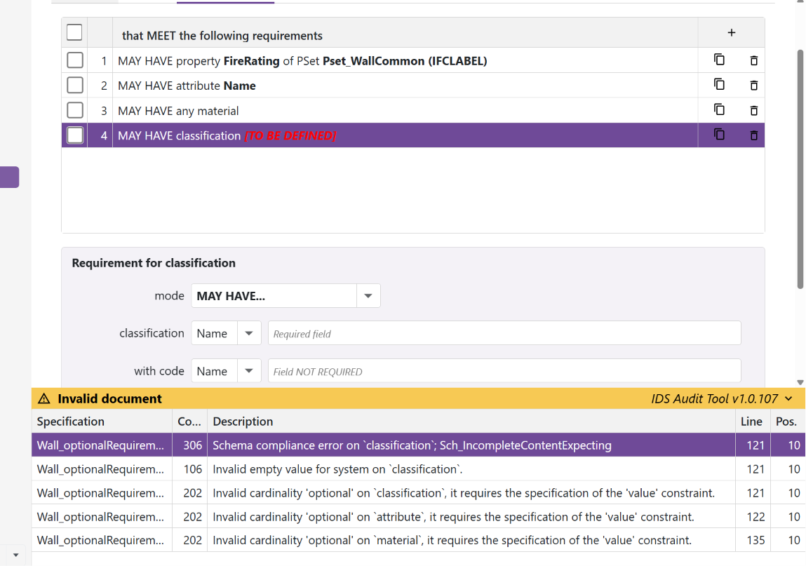

*Figure 1. usBIM.IDSeditor Audit Tool flagging error 202 on three Optional requirements (Attribute 'Name', Material, Classification) that have no value or identifying parameter specified.*

### Observation

- "MAY HAVE attribute Name" (no value) → 202: "Invalid cardinality 'optional' on 'attribute', it requires the specification of the 'value' constraint."
- "MAY HAVE any material" (no value) → 202, same reason.
- "MAY HAVE classification" (no System selected) → 202, plus a schema-compliance error, since System is also a mandatory parameter for the Classification facet.

### Working explanation

Optional cardinality means: "if the facet is present on a filtered entity, it must comply with what is specified; if absent, the entity still passes." For "must comply" to mean anything, something has to be specified to comply with. Without a value (or, for Classification, without even a System), there is nothing for the rule to check: every possible case — the facet present or absent, with any content — would pass regardless. A rule that can never fail has no discriminating power, and the IDS-Audit-tool (buildingSMART's official validator, used internally by usBIM.IDSeditor) rejects it rather than save a non-functional requirement.

This is not specific to usBIM: error 202 originates in the IDS-Audit-tool maintained by buildingSMART International and is rooted in the IDS XML Schema itself, so any IDS-compliant validator would behave the same way.

---

## 4. Experiment 1 — Optional Property with Data Type only (no Value)

**Question:** does the 202 rule apply identically to every facet, or can a facet pass Optional cardinality without a Value under some condition?

### Configuration

- Applicability: MUST contain → IFCWALL
- Requirement: MAY HAVE property Pset_WallCommon.IsExternal, Data Type = IFCBOOLEAN, Value = (none)

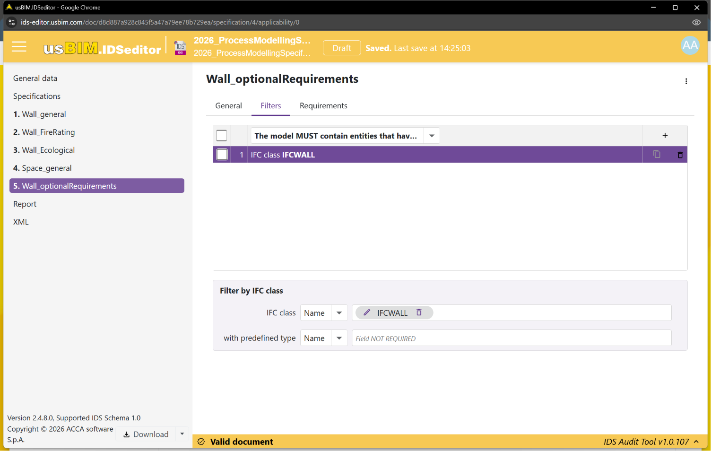

*Figure 2. Applicability set to "MUST contain… IFCWALL" ("Wall_optionalRequirements").*

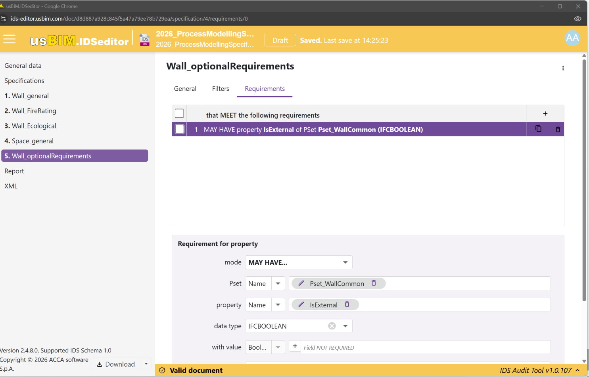

*Figure 3. Requirement "MAY HAVE property IsExternal of Pset_WallCommon (IFCBOOLEAN)" — Data Type specified, Value field left as "Field NOT REQUIRED". Document status: Valid.*

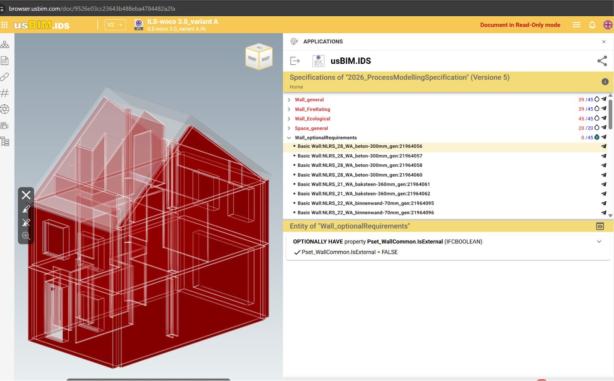

*Figure 4. Live validation in usBIM.IDS: 0/45 non-conformities. The selected wall shows "✓ Pset_WallCommon.IsExternal = FALSE" — the property is present, its value is reported, and the requirement is verified.*

### Result

**No error 202.** The document was accepted as Valid, and live validation returned 0/45 — zero non-conformities across all 45 walls.

### Interpretation

Unlike Attribute or Material, the Property facet has an additional parameter independent of Value: Data Type. Specifying a Data Type alone ("if present, must be IFCBOOLEAN") already gives the validator something concrete and falsifiable to check, satisfying the Audit Tool's requirement that an Optional rule have at least one constraining parameter — without needing a Value at all.

---

## 5. Experiment 2 — Same configuration, property absent from the model

To test the other branch of Optional logic (absence, not just presence), the same pattern was applied to a property that does not exist on any wall in this model.

### Configuration

- Requirement: MAY HAVE property Pset_WallCommon.AcousticRating, Data Type = IFCLABEL, Value = (none)

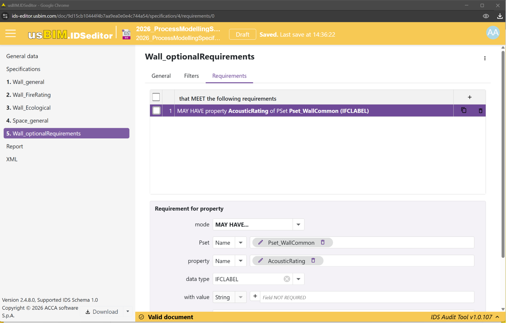

*Figure 5. Requirement "MAY HAVE property AcousticRating of Pset_WallCommon (IFCLABEL)", no value. Document status: Valid.*

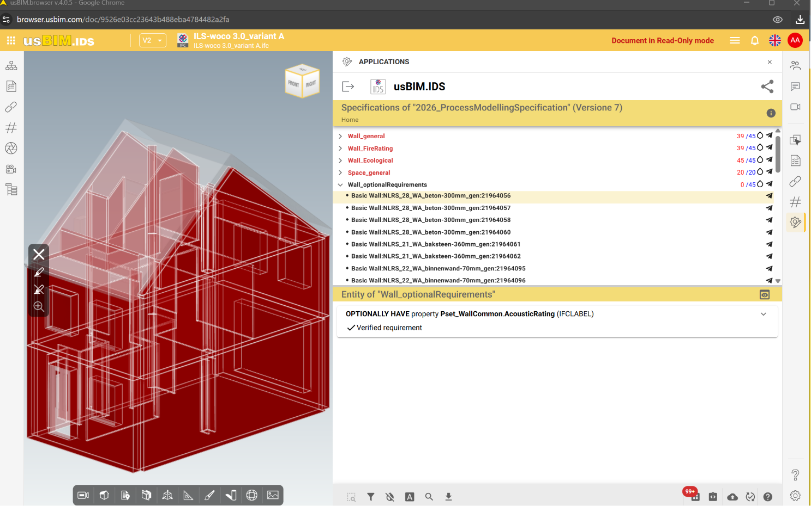

*Figure 6. Live validation result: 0/45. The selected wall shows "✓ Verified requirement" with no value displayed, since AcousticRating is absent from the model's walls.*

### Result

0/45 — zero non-conformities. "Verified requirement" is shown with no value, confirming the property's absence is treated as fully compliant under Optional cardinality.

### Interpretation

Together, Experiments 1 and 2 confirm both halves of Optional cardinality function correctly for Property: presence with a matching Data Type passes, and absence also passes. The requirement could only fail if a wall had AcousticRating present with the wrong Data Type — a case not present in this model, but logically the only failure path available.

---

## 6. Experiment 3 — Optional Attribute with an arbitrary Value ("N/A")

Returning to the Attribute facet that triggered the original 202 error: does simply adding any value resolve it, and if so, does the placeholder "N/A" behave any differently from a real value?

### Configuration

- Requirement: MAY HAVE attribute Name = "N/A"

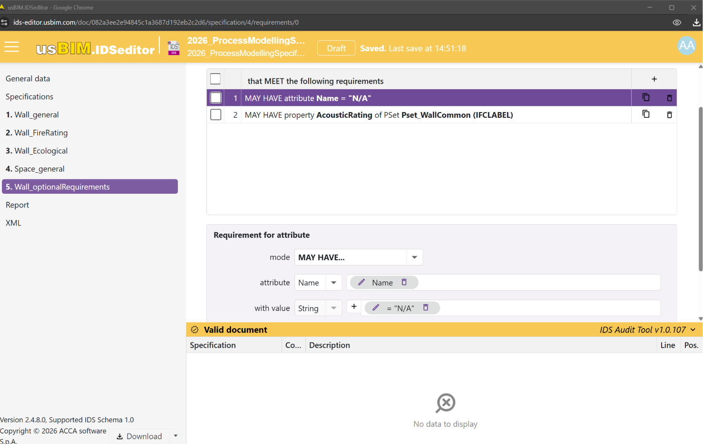

*Figure 7. Requirement "MAY HAVE attribute Name = 'N/A'". Document status: Valid — no error 202, and the Audit Tool error grid is empty ("No data to display").*

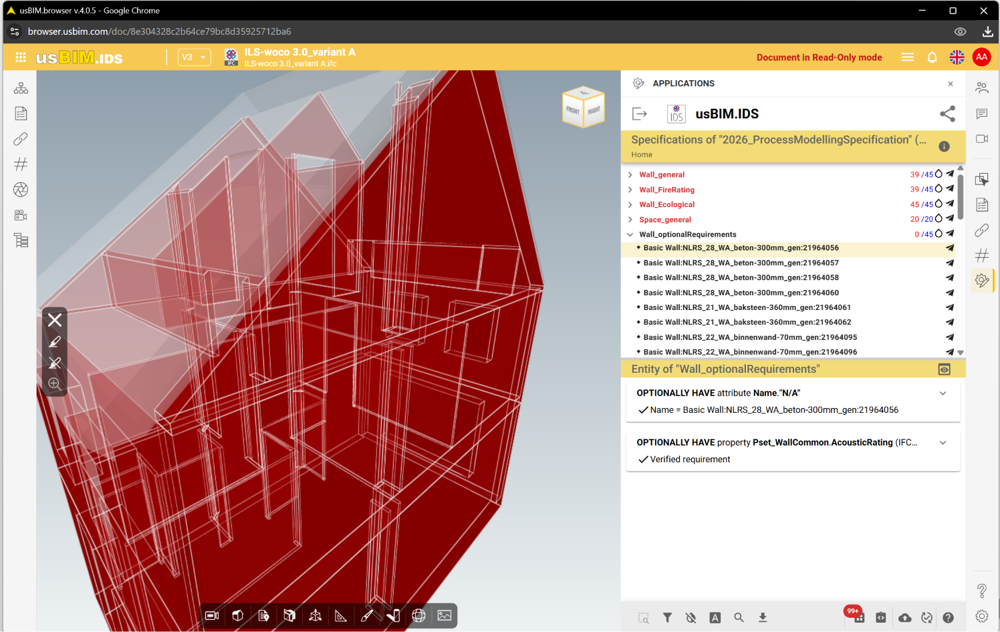

*Figure 8. Live validation result: 0/45. The selected wall shows "✓ Name = Basic Wall:NLRS_28_WA_beton…" — the attribute's actual value is reported, despite not equalling "N/A".*

### Result

No error 202. 0/45 across all 45 walls — including this one, whose actual Name is clearly not "N/A", yet the requirement is reported as satisfied.

### Open question raised by this result

This result raises the central question for the rest of the investigation: does the Value field actually get enforced as a match condition during validation under Optional cardinality, or does it only need to be present for the document to be schema-valid? Experiment 3 alone cannot distinguish these, since no wall is expected to be named "N/A" — a true match was never possible in this test.

---

## 7. Experiment 4 — Optional Attribute with an exact-match Value

To remove the ambiguity in Experiment 3, the Value was changed to the exact, real Name of one specific wall in the model (Basic Wall:NLRS_28_WA_beton-300mm_gen:21964056), so that exactly one of the 45 walls could genuinely match, and 44 could not.

### Configuration

- Applicability: MUST contain → IFCWALL
- Requirement: MAY HAVE attribute Name = "Basic Wall:NLRS_28_WA_beton-300mm_gen:21964056"

*Figure 9. Live validation result: 0/45 across all 45 walls, even though only one wall's actual Name matches the specified value.*

### Result

**0/45 — zero failures.** All 44 walls with a different Name still pass, alongside the one wall that genuinely matches.

### Interpretation

If the Value were being enforced as a match condition, 44 of the 45 walls should have failed here. None did. This is the first direct evidence that, under Optional cardinality, the specified Value is not checked against the model — only the presence of the attribute is.

---

## 8. Experiment 5 — Control: the identical Value under Mandatory cardinality

To confirm Experiment 4's result is a genuine cardinality effect — and not a tool malfunction, or coincidental to this particular value — the identical exact-match Value was re-tested with the Requirement cardinality switched from MAY HAVE to MUST HAVE, holding Applicability and the Value string constant.

### Configuration

- Applicability: MAY contain → IFCWALL (changed from Experiment 4; addressed in Experiment 6)
- Requirement: **MUST HAVE** attribute Name = "Basic Wall:NLRS_28_WA_beton-300mm_gen:21964056" (cardinality changed from MAY HAVE to MUST HAVE)

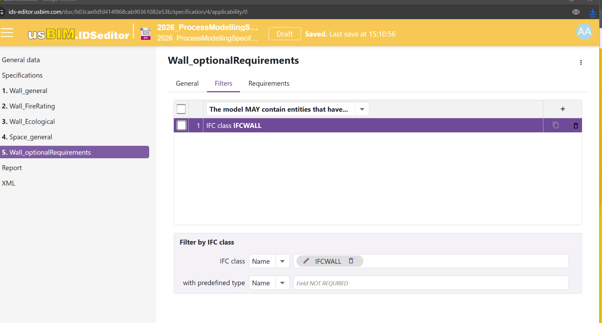

*Figure 10. Applicability tab showing "MAY contain… IFCWALL".*

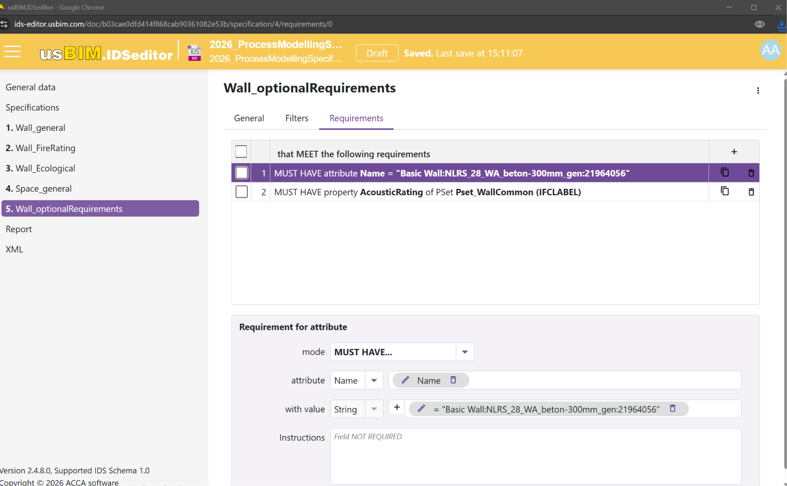

*Figure 11. Requirement cardinality changed to "MUST HAVE attribute Name = …", same exact-match value as Experiment 4.*

![Figure 12. Live validation, selected wall: ✗ [602] Incorrect attribute — even the one wall whose Name should match now fails, because AcousticRating (also Mandatory in this version) is additionally required and absent: ✗ [301] Property not found.](images/test5_detail.png)

*Figure 12. Live validation, selected wall: ✗ [602] Incorrect attribute and ✗ [301] Property not found.*

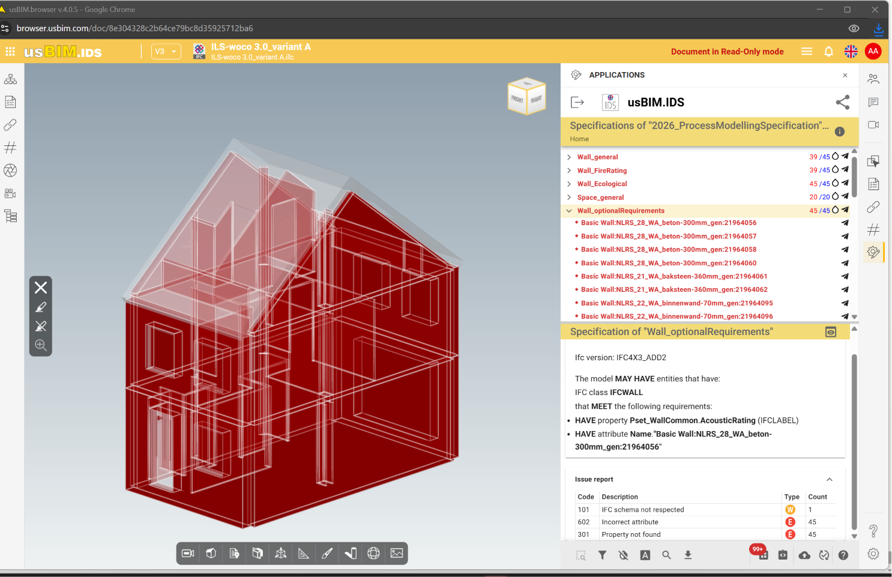

*Figure 13. Specification summary and issue report: 602 (Incorrect attribute) × 45, 301 (Property not found) × 45.*

### Result

**45/45 — all walls fail.** The PDF/summary report records 602 "Incorrect attribute" on all 45 walls (the Name mismatch is now correctly detected) plus 301 "Property not found" on all 45 (AcousticRating, also now Mandatory, is absent from every wall).

### Interpretation

This is the decisive control. With the identical Value string, Mandatory cardinality correctly detects and flags a mismatch (602) on every non-matching wall, while Optional cardinality (Experiment 4) flagged none. Cardinality, not the value itself, is the variable that determines whether a mismatch is enforced.

---

## 9. Experiment 6 — Isolating Applicability cardinality as a confound

Experiment 5 changed two variables relative to Experiment 4 at once: Requirement cardinality (MAY HAVE → MUST HAVE) and Applicability cardinality (MUST contain → MAY contain). To confirm Applicability cardinality was not the actual cause of the 45/45 result, one final test held Applicability at "MAY contain" while restoring the Requirement cardinality to MAY HAVE, using the same exact-match Value.

### Configuration

- Applicability: MAY contain → IFCWALL (held constant, matching Experiment 5)
- Requirement: MAY HAVE attribute Name = "Basic Wall:NLRS_28_WA_beton-300mm_gen:21964056" (restored to Optional)

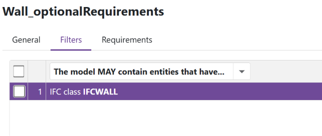

*Figure 14. Applicability: "The model MAY contain entities that have… IFC class IFCWALL."*

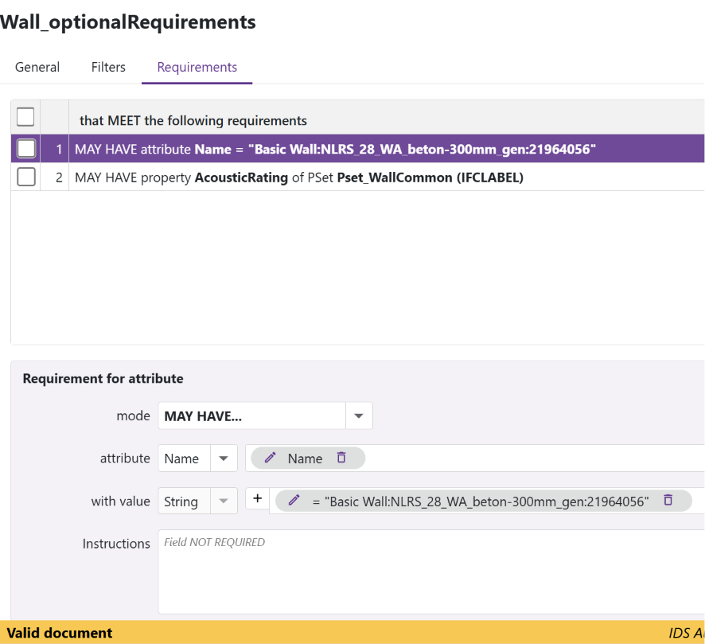

*Figure 15. Requirement restored to "MAY HAVE attribute Name = …". Document status: Valid.*

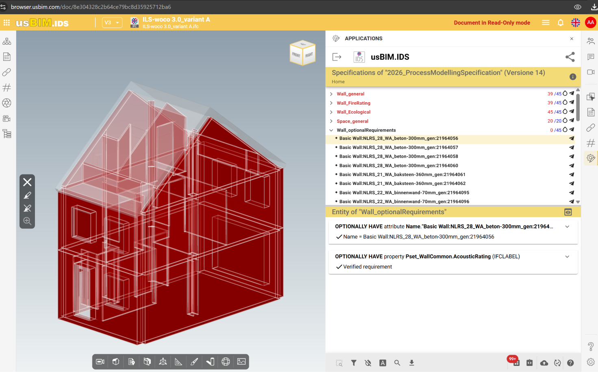

*Figure 16. Live validation result: 0/45, identical to Experiment 4, now with Applicability cardinality controlled for.*

### Result

0/45, identical to Experiment 4. With Applicability cardinality now held constant across the Optional and Mandatory comparisons (Experiments 4–6 use "MAY contain" consistently), the outcome is unchanged.

### Interpretation

This rules out Applicability cardinality as a confound. The Requirement cardinality (Optional vs. Mandatory) alone fully accounts for the difference between 0/45 and 45/45 observed across Experiments 4 and 5.

---

## 10. Consolidated Test Matrix

The full sequence of controlled experiments, in order, with the single variable changed at each step:

| # | Facet / Value | Applicability | Requirement cardinality | Result |
|---|---|---|---|---|
| 0 | Attribute / Material / Classification, no value | — | Optional | 202 error (document invalid) |
| 1 | Property IsExternal, Data Type only, no value (present on model) | MUST contain | Optional | Valid · 0/45 |
| 2 | Property AcousticRating, Data Type only, no value (absent from model) | MUST contain | Optional | Valid · 0/45 |
| 3 | Attribute Name = "N/A" (no wall matches) | MUST contain | Optional | Valid · 0/45 |
| 4 | Attribute Name = exact match (1 of 45 walls matches) | MUST contain | Optional | 0/45 (no mismatch detected) |
| 5 | Attribute Name = identical exact match | MAY contain | Mandatory | 45/45 (mismatch + absence both detected) |
| 6 | Attribute Name = identical exact match | MAY contain | Optional | 0/45 (confirms Exp. 4, rules out Applicability as cause) |

---

## 11. Findings

### 11.1 — Why error 202 occurs (Attribute, Material, unconstrained Classification)

Optional ("MAY HAVE…") cardinality means: if the facet is present on a filtered entity, it must comply with what is specified; if it does not exist, the entity still passes, since presence is not required. For "must comply" to be meaningful, something has to be specified for it to check against. Attribute and Material have only one parameter capable of carrying such a constraint: Value. Without it, every possible case — the facet present or absent, taking any value — passes regardless, and the rule can never distinguish a compliant entity from a non-compliant one. The IDS-Audit-tool (buildingSMART's official validator) rejects this as a non-functional rule rather than save a requirement that could never report a non-conformity (error 202).

Property is structurally different: it carries an independent Data Type parameter, separate from Value. Specifying only a Data Type ("if present, must be of this type") is itself a complete, falsifiable constraint, so an Optional Property requirement can be schema-valid without any Value at all (Experiments 1 and 2). This — not a difference in how Property and Attribute are "treated" — is the structural reason Property rarely triggers 202: it simply has a second available constraining parameter that Attribute and Material do not.

This behaviour is not specific to usBIM.IDSeditor. Error 202 originates in the official IDS-Audit-tool maintained by buildingSMART International, which usBIM.IDSeditor calls internally, and reflects a constraint of the IDS XML Schema itself. Any IDS-compliant validator would be expected to behave the same way.

### 11.2 — The Value field is not enforced as a match condition under Optional cardinality (usBIM.IDS)

> **Key finding:** Once a Value is supplied to satisfy the schema's constraint requirement, it is accepted by the validator (usBIM.IDS) for any entity that has the facet present — regardless of whether the entity's actual value matches what was specified. The Value parameter functions to make the document schema-valid (avoiding error 202), but it is not enforced as a semantic match condition at validation time when cardinality is Optional.

This was demonstrated by a controlled comparison (Experiments 4–6): the identical exact-match Value, on the identical model and the identical wall population, produced 0/45 under Optional cardinality and 45/45 under Mandatory cardinality. Mandatory cardinality clearly can detect and report a mismatch (error 602, "Incorrect attribute"); Optional cardinality, with the same data, does not.

Practically, this means a requirement written as "MAY HAVE attribute Name = X" currently behaves, in usBIM.IDS, more like "this attribute may exist, and its found value will be reported" than like "if this attribute exists, it must equal X." The placeholder value "N/A" (Experiment 3) therefore works exactly as well as a real, precise value (Experiment 4) for the purpose of satisfying the schema — neither is checked against the model.

This finding is specific to the observed behaviour of usBIM.IDS and has not been cross-validated against another IDS-compliant tool. It is reported here as an empirical observation, not as a defined property of the IDS standard, and is worth flagging to ACCA software or buildingSMART for clarification.

### 11.3 — Why MUST HAVE does not need a value, but MAY HAVE does

MUST HAVE (Mandatory cardinality) only ever evaluates one condition: does the entity have the facet, yes or no. Existence alone is already a complete, checkable requirement — there is nothing missing, which is why a bare "MUST HAVE attribute Name" (no value) is perfectly valid and functions correctly.

MAY HAVE (Optional cardinality) cannot use existence alone as its condition, because existence-or-absence is already allowed either way by definition — that is what "optional" means. If existence alone were the whole rule, it would be indistinguishable from having no requirement, and there would be no reason to use MAY HAVE instead of MUST HAVE. So MAY HAVE depends on a second condition — what the value should be, if the facet is present — to remain a meaningful, checkable rule at all. Without that second condition specified, the rule is incomplete, and the Audit Tool blocks it (error 202).

What Experiments 3–6 show is that, once that second condition (a Value) is supplied, the IDS document becomes structurally valid — but the validator does not appear to actually carry out the second check (verifying the value) the way it does under Mandatory cardinality. It correctly performs the first check (existence) and reports the found value for transparency, but does not compare it against the specified Value to determine pass/fail.

### 11.4 — Implications for writing the Exchange Requirements (ER)

An ER item marked Optional (O) with genuinely no constraint on its content, if present, cannot be expressed as a meaningful IDS Requirement — not because IDS has a gap, but because "optional, with any value" is not, in itself, a well-formed requirement. If a client truly does not care what value an attribute takes when present, that is not an information requirement; it is closer to a note that the attribute exists in the data model, and belongs in supporting documentation (the IDS Instructions field, or the EIR narrative text), not as a Requirement facet.

A well-formed Optional ER item should always specify, for every item marked (O), what compliance looks like if the item is present — an expected value, a pattern, a range, or (for properties) a Data Type. Only with that detail can the requirement be expressed in IDS at all, and — in light of Finding 11.2 — ER authors using usBIM.IDS should additionally be aware that an Optional requirement currently only verifies presence (and, for Property, Data Type), not the specific value entered, even when a value is supplied.

---

## 12. Reply Provided to the Student

The following response was prepared based on the findings above:

> **1.** The 202 error happens for Attributes (and Materials) if there is no value provided when the constraint is MAY HAVE in Requirements. This error does not easily happen on Property or Classification because the tool and user interface urge you to add further details.
>
> **2.** MUST HAVE checks the existence of an attribute: it is either present or absent, and that alone is already a complete, checkable rule. MAY HAVE cannot work the same way, because presence or absence is already allowed either way by definition. So MAY HAVE needs a value to be a valid rule — otherwise any entity may have any attribute, and the rule provides no value.
>
> **3.** Based on direct testing, any value satisfies this requirement, as long as something is there. The exact name of one specific wall was set as the value and applied across 45 walls; all 45 passed, including the 44 with a completely different name. The found value is reported to the user, but a mismatch is not flagged as a failure. This is the opposite of MUST HAVE, where present-but-wrong-value is correctly flagged as a failure when the same value was tested.
>
> **4.** So, adding "N/A" as a value for the MAY HAVE attribute resolves the error, and any other value, even a precise one such as the wall's real name, makes no difference to the validation result.
>
> **5.** To answer the second question: an attribute in the ER marked (O) can still be expressed as an IDS requirement using a value such as "N/A", or, better, the ER can be updated to specify what the value should be if the attribute is present.
>
> **6.** This question and the exploration it prompted should be written up as part of the report, as exactly the kind of investigation and interpretation of validation behaviour the module is intended to encourage.

---

## 13. Evidence Sources

- usBIM.IDSeditor (Audit Tool v1.0.107) — document validity, error 202 grid, facet configuration screenshots
- usBIM.IDS / usBIM.browser v4.0.5 — live per-specification and per-element validation results
- "Reports of 2026_ProcessModellingSpecification.ids" (PDF), multiple versions — aggregate issue counts and codes per specification
- ILS-woco 3.0_variant A — issues.xlsx export — element-level (IfcGlobalId) validation detail
- 2026_ProcessModellingSpecification.ids (raw XML), multiple versions — ground-truth cardinality and parameter values for each test
- IDS for Everyone (ACCA software S.p.A., 2024) — manual definitions of Applicability and Requirement cardinality, Chapters 4–6
